# CLAUDE-SPINE

An MCP server that rigs and animates **Spine 4.2** skeletons the way a slots
studio ships them. It builds clean silhouette meshes, heat-diffused weights,
IK, physics, a 2.5D turn rig, a juice preset library built on a fixed symbol
animation contract, FX, and a mobile performance budget guard. Every output is
loaded and played in the official `spine-core` runtime before it counts as
done.

Built from [egorfedorov/spine-mcp](https://github.com/egorfedorov/spine-mcp)
(MIT) and restructured around one typed model of the Spine format, with small
tools that do one job each.

| | | |
|---|---|---|
| 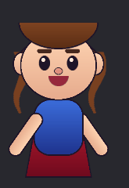 IK arm + physics hair | 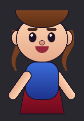 2.5D turn from one control | 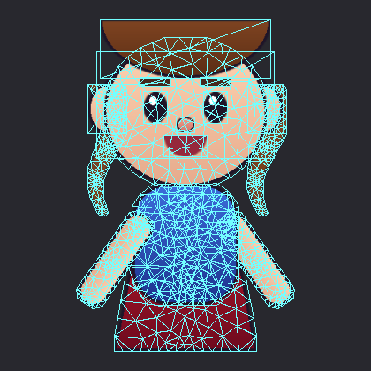 contour meshes |
| 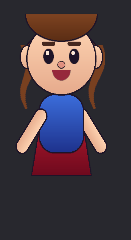 `land`: drop, squash, settle | 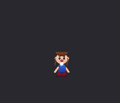 `win_epic`: coins, flash, shockwave | 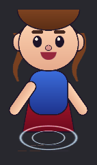 seamless water ripple |

*The previews are rendered from the procedural sample character
(`examples/build_demo.py`) through the spine-core runtime.*

## Install

You need Python 3.10+ and [uv](https://docs.astral.sh/uv/). Node 18+ is
needed for validation and previews. The Spine editor is optional; with it you
also get editable `.spine` projects.

```bash
claude mcp add -s user claude-spine -- uvx --from git+https://github.com/kumikilongyeyo/CLAUDE-SPINE claude-spine
```

Pin to a commit you have reviewed by adding `@<sha>` after the URL. Set
`SPINE_BIN` if Spine is not in the default place
(`/Applications/Spine.app/Contents/MacOS/Spine` on macOS,
`C:\Program Files\Spine\Spine.com` on Windows). The spine-core runtime
installs itself with `npm` the first time it is used. Run the `doctor` tool to
check everything.

## The tools

| Stage | Tool | What it does |
|---|---|---|
| Setup | `doctor`, `make_sample`, `inspect_psd`, `import_psd`, `project_info` | Check the toolchain; turn PSDs into a project (`<name>.json` + `images/`) |
| Bones | `add_bones`, `add_chain`, `reparent_slot` | Add bones in world coordinates. Art never moves |
| Mesh | `rig_mesh`, `rig_volume_2p5d` | Region → contour mesh with bone-heat weights; layer centre-volume weights over an existing rig for squash/bulge/2.5D bounce |
| Constraints | `rig_ik`, `rig_physics`, `rig_transform`, `rig_strand`, `rig_turn` | IK, Spine 4.2 physics, drivers, one-call hair/cape/tail rigs, 2.5D head turn |
| Motion | `juice_apply`, `fx_generate`, `fx_recipe`, `fx_style_profile`, `ae_vfx_plan`, `ae_vfx_review`, `ae_quick_look`, `ae_vfx_to_spine`, `relight_from_fx`, `optimize_draw_order`, `volume_bounce`, `optimize_animation`, `ae_template`, `ae_fx_to_spine`, `add_keys`, `add_event` | Symbol clips, authored FX (`kit="realistic"` swaps every picture for bundled CC0 photographic particles), global style profiles, AE VFX direction/self-review, optimized AE sequences, sparse 2.5D bounce, adaptive key cleanup, custom easing and game events; `tintable` imports recolour one AE frame set per slot |
| QA | `validate`, `qa_budget`, `qa_character`, `qa_fx_premium`, `preview` | Structural and runtime validation, mobile budget, character QA, heuristic FX art-direction QA, GIF previews |
| Characters | `rig_face`, `face_clip`, `look_at`, `lipsync`, `rig_biped`, `clip_set`, `secondary`, `squash_stretch` | Whole-face rig and 2.5D turn from layer names (clamped eyes, blinks, brows, visemes, jaw); biped rig with floor-pinned IK feet and the 11-clip character contract; physics on every strand; volume-preserving squash |
| Animals | `gait`, `rig_quadruped`, `rig_serpent`, `rig_flier`, `attach_rig`, `rig_creature` | Footfall-table locomotion with planted feet; one-call quadrupeds; swimming and flying chains; snap-on ears, tails, wings, horns, digitigrade legs, mermaid tails, snake hair, fur and glow whose clips merge into any host; slime, golem, ghost, tentacle beast, dragon, insect, plant monster and mimic |
| Samples | `make_face_sample`, `make_biped_sample`, `make_quadruped_sample`, `make_serpent_sample`, `make_flier_sample`, `make_host_sample`, `make_creature_sample` | Procedural PSD-named sample rigs to try every recipe on |
| Export | `pack_atlas`, `make_editable`, `export_runtime` | Atlas + runtime folder; editable `.spine` through the Spine CLI |
| Symbol from the art | `sphere_spin`, `liquid_splat`, `sugar_splat_ae`, `sugar_splat_to_spine`, `shake`, `ae_check`, `edit_slots`, `clone_art`, `art_twin`, `hue_cycle` | A round symbol turned in real 3D from its own art (the cap swings behind the ball); a liquid splat built from the artist's splash layers; a physically simulated melted-sugar splat made gooey in After Effects; a violent build-up shake; read a saved After Effects project's comps and script errors without AE; hide / show / remove / re-blend / re-tint / reorder slots (draw-order keys kept); copy a symbol's art and bones to another spot (shared images); additive twins and a colour-wheel wash |
| Coins | `rig_coin`, `coin_spin` | A flat coin face made into a real extruded disc: the near and far faces slide apart as it turns and a reeded side wall shows between them (one weighted mesh, nothing keyed per vertex). Depth thin / medium / thick. Spins as a seamless loop, an eased flip, an anticipation spin-up, a slow-down or a tumbling landing, always stopping face-on |
| AE FX library | `ae_library`, `ae_library_textures`, `ae_library_to_spine` | 50 finished After Effects effects as procedural builders: 18 cel (toon) slot effects and 32 realistic ones made of CC0 photo / Kenney textures (the same effects, 6 glows, 8 elements). Build any of them into an open project in one call, then one Spine skeleton per effect at a mobile-aware texture budget |
| Banner FX | `magic_puff_ae`, `magic_puff_to_spine` | A magic smoke puff for a wide banner that is a real smoke simulation: from nothing it bursts out of the centre both ways (no mirror), held in a band between gold lines, curls up at the ends, loses its glow as it swirls and dissolves thin-first. After Effects gives the look; Spine gets one smoke sequence plus native lights and glitter that ride the simulated flow |

A typical session, as Claude would run it:

```
import_psd   psd=wild.psd  out_dir=./wild  origin=center
rig_mesh     slot=cape  bones=[cape1, cape2, cape3]
rig_strand   slot=hair_lock_l  n_bones=4  physics=hair
rig_ik       bones=[arm_r1, arm_r2]
rig_turn     head_bone=head  face_slot=face  features={nose: 1.25, eye_l: 0.9, eye_r: 0.9, ear_l: -0.35}
juice_apply  fx=true  shine_slot=gem               → idle, land, win, win_loop, anticipation, dim
fx_generate  preset=coin_burst  into=win
validate     → qa_budget profile=mobile_symbol → preview → make_editable / pack_atlas
```

FX recipes (rune ring, flare, wisps, aura, floor glow, fireflies, twinkles, or all seven as `magic_reveal`) are one tool:
`fx_recipe` lists them, `fx_recipe recipe=guide` explains how to use, fork and mix them (also in [docs/FX_RECIPES.md](docs/FX_RECIPES.md)).

The recipe's **physics stays the same while the art direction can change globally**:

```
fx_recipe recipe=explosion style=stylized
fx_recipe recipe=explosion style=premium relight_slots=["symbol"]
fx_recipe recipe=explosion realism=0.85 relight_slots=["symbol"]
```

For editable production rigs, keep deformation and timeline cleanup separate:

```
rig_volume_2p5d slots=["face"] strength=0.6
volume_bounce bones=["volume_core"] animation="win"
optimize_animation animation="win" mode=editable
```

`rig_volume_2p5d` preserves the mesh's existing turn/limb weights, adds one centre-heavy
volume influence, pins the rim by default, and re-normalises to the mobile influence cap.
That lets the centre squash/bulge while the silhouette and original 2.5D deformation keep
working. `volume_bounce` uses only a handful of meaningful impact/rebound/settle keys.
`optimize_animation` reduces dense linear samples after the full clip is assembled, keeps
extrema/holds/endpoints, and rebuilds monotone Bezier handles; authored or stepped curves are
left untouched unless explicitly forced.

`style=` is `stylized | premium | realistic`; `realism=0..1` continuously interpolates graphic -> physical.
`fx_style_profile` lists the profiles and can turn normalised measurements from the `clip-breakdown` skill into a
reusable `style_profile`. Styled recipe results also return semantic `back / subject / front / lens` depth groups and
recommended parallax strengths. `relight_slots` adds a short additive response made from the target's own art so a hit
lights the thing it hits; `qa_fx_premium` lints lighting integration, depth, hierarchy, materials and readability.

### AE FX library

`ae_library` lists 50 finished After Effects effects and writes one script that builds any of them (plus what they
need) in the open project; `ae_library_to_spine` renders a comp with aerender and makes one skeleton `fx_<name>` per
effect (animation `<name>` on bone `fx`), packed at the entry's budget (soft full-screen effects at half size and
scaled back up, slow loops subsampled). Cel effects are self-contained; realistic ones (`re_*`, `gl_*`, `el_*`)
need the texture folder from `ae_library_textures` once (Kenney Particle Pack + Smoke Particles, CC0, downloaded;
21 CC0 / public-domain photos committed with their credits in `claude_spine/ae_library/textures/`).

```
ae_library kind=element                                   # list
ae_library_textures dest=~/fx_textures                    # once per machine
ae_library names=[re_fire_rose_burst, el_lightning_strike] out_dir=./fx textures_dir=~/fx_textures save_as=./fx/fx.aep
# run the returned run_with with the After Effects MCP's ae_run_script
ae_library_to_spine name=el_lightning_strike out_dir=./fx/spine aep=./fx/fx.aep
```

Every effect was matched to its reference frame by frame (measured size, colour, timing; built procedurally,
nothing traced), and rebuilt from these files into an empty project to check: renders are pixel-identical except
the random Advanced Lightning arcs.

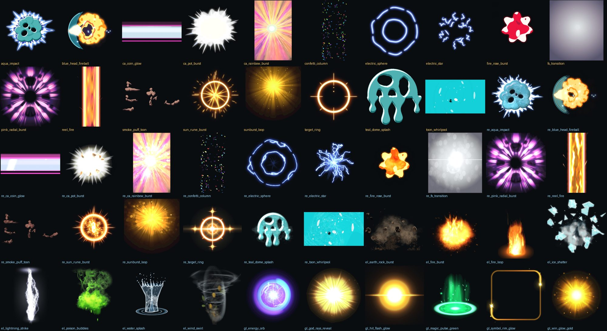

### AE VFX director

For hero effects, use the director before the low-level After Effects MCP calls:

```
ae_vfx_plan brief="heavy fire punch" event=fire_hit style=realistic target=mobile_feature
# build in After Effects, then judge its four key frames over the real art (one contact sheet)
ae_quick_look aep=... comp=... art=coin_face.png
ae_vfx_review metrics={readability:8.5,impact:9,depth:8,lighting_integration:8.5,motion_flow:8,texture_quality:8,timing:9,clarity:8.5}
ae_vfx_to_spine project=... name=fire_hit aep=... comp=... event=fire_hit style=realistic target=mobile_feature
```

The plan gives Claude a stable comp hierarchy (`00_CONTROLS` through `07_FINISH`), compressed impact timing,
physical light-integration rules and a review rubric. The production importer wraps the raw `ae_fx_to_spine` bridge:
it trims empty frames, caps frame count and texture size by target, preserves playback speed while subsampling,
feathers comp edges, and keeps repeated `copies=` on one shared image sequence. Explicit size/frame settings still
override the policy when a shot genuinely needs them. `magic_glow`, `magic_smoke` and `prism_glow` templates are built to import that way; `spectrum=0.05` splits a white glow into rainbow bands
from the same frames. `tintable=True` stores a two-tone effect (electricity, lightning,
frost, smoke) as grey frames coloured by the slot's light and dark colour, so copies play it in any colour from one frame set;
the result grades the fit (fire and gold glows grade poor: make those variants in AE).


The two FX on every spin are recipes too: `reel_stop` (the strip overshoots, squashes and springs back on an exact
spring, dust, shock rings, screen shake) and `anticipation_reel` (an accelerating heartbeat glow with edge flames while
the other reels dim). They move your reel and screen bones through inserted carrier bones, never your own keys.

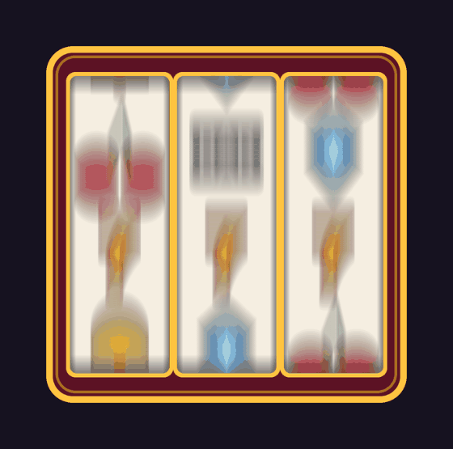

The rest of a slot game is recipes too, one family per moment (`fx_recipe` with no recipe lists them all; the guide
is [docs/FX_RECIPES.md](docs/FX_RECIPES.md)). Every one takes `tier=` small | medium | big | mega | epic, and
`sequence` turns a whole win choreography into a JSON list. Recipes that move your reel, symbol, screen or button bones
do it through inserted carrier bones, never your own keys.

| | | |
|---|---|---|
| 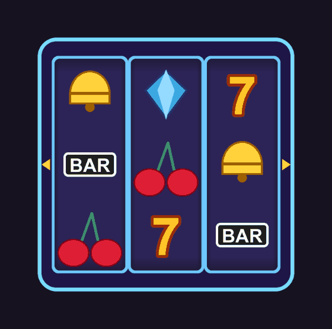 spin: near_miss, spin_blur, turbo_spin, screen_shake | 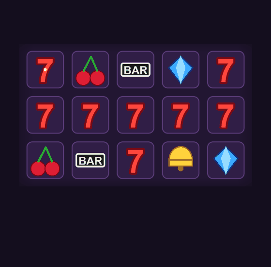 wins: payline, win_highlight, multiplier_stack, win_rollup |  win_banner: big, mega, epic from one recipe |
| 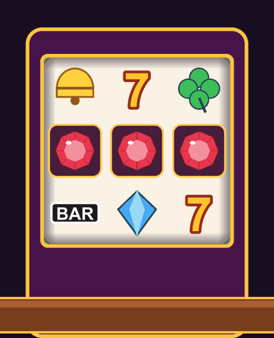 payouts: coin_fountain, cascade_pop | 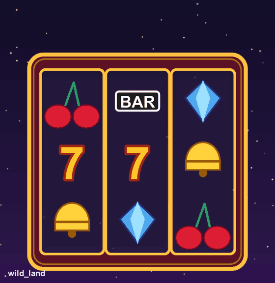 features: wild_land, expanding_wild, scatter_trigger, free_spins_transition | 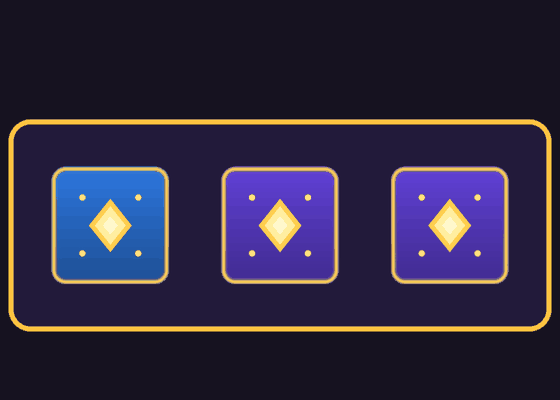 bonus: pick_reveal, hold_respin, jackpot_wheel, meter_fill |
| 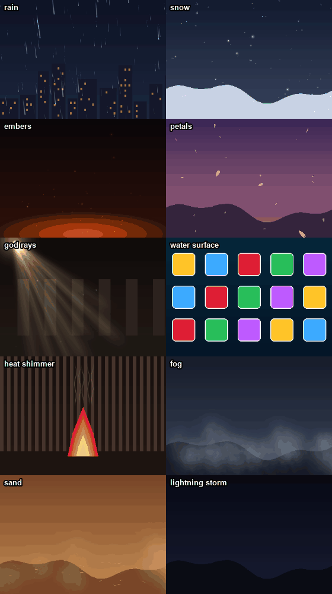 ambient: weather, god_rays, water_surface, heat_shimmer, fog_roll, lightning_storm | 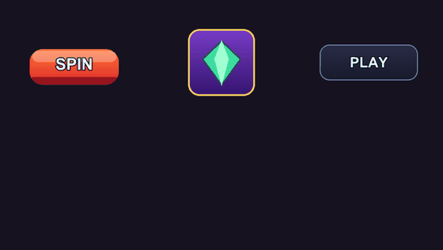 UI: button_press, idle_shimmer, focus_glow, padlock, popup |  saber: a port of Video Copilot's Saber (Spine + AE template) |
| 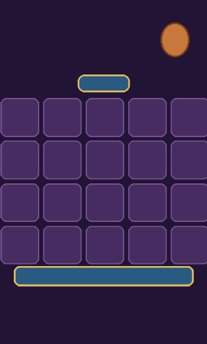 piñata: wild_glow, wild_transform, mult_cell_glow, cell_pop, confetti_burst, mult_streak, wild_merge, coins_to_bar, bar_sweep, pinata_hit, jar_burst, banner_backdrop (one picture kit; swap in a texture pack by name, `gain` / `thick` retune it) | | |
| speed_lines: anime focus lines that flicker like hand-drawn ones and rush in on the hit | AE template fire_aura: a flame ring shooting out of a hole (fire or electric), built on the fire template | ae_fx_to_spine sequences follow a rotated / scaled parent bone (aim a flame along a reel edge or away from a punch) |
| 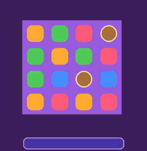 cluster pays: cluster_dim, combo_banner, amount_to_bar, jelly_pop, scatter_shine (AE upgrades for glitter / coin spray as ae_hint) | ae_fx_to_spine copies=: many instances of one sequence sharing its frames | |
| 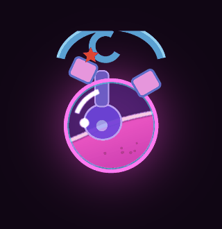 props: prop_idle (grow, tilt, overshoot, glow) and liquid_slosh (world-space surface, clipping mask) on YOUR rig | | |
| 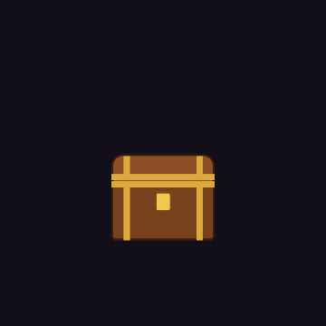 prop library: 26 recipes (reveal: peek, shake, open, hit, upgrade, shatter; collect: absorb, overflow, counter_plate, multiplier_slam, charge, gem_glint; living: bob, blink, breathe_heavy, hover_spin, dangle, sway_wind; elements: flame_wick, liquid_bubble, drip, steam, electric, freeze, dissolve, smoke_wisp) | bundles: bonus_chest_reveal, collect_into_prop, pinata_style_break, magic_vessel (chained on events) | all on YOUR rig through carriers |

Some symbols are best animated from the artist's own pixels rather than procedural stand-ins:

- `sphere_spin` turns a round symbol (ball, bomb, orb) around its vertical axis with real depth. A `scaleX` card flip
  squeezes a ball to a sliver; this wraps the art onto a sphere, tiles its pattern round the back by the pattern's own
  period, keeps the light and the glints where they are, and renders a frame sequence keyed frame by frame. Bones on
  the surface (a cap) orbit it and pass behind the ball through draw-order keys; side bones (a wick) flip as they turn.
- `liquid_splat` builds a splat from the artist's splash layers, beat by beat from a reference candy-slot burst:
  implode with a star, a zoom-blurred smear, a ring of liquid flying out with a hollow centre, ribbons that thin and
  shrink away together, drips raining off, rays and a lens streak. Each piece gets a radial bone, so stretch and squash
  act along its flight. `prefix` + `offset` clone the kit for one splat per symbol in a column.
- `sugar_splat_ae` + `sugar_splat_to_spine`: a melted-sugar splat that is *physical*: it goes out, then gets smaller
  by breaking up (never by pieces shrinking in place). Python simulates the liquid on air drag and gravity (centre
  globs that swell and drain, globs at uneven speeds dragging syrup ligaments, tearing into drops with teardrop tails,
  tearing again into droplets that fall) and writes an After Effects script: one shape layer per drop, one precomp
  per candy colour finished as metaballs (Turbulent Displace, Fast Box Blur, Levels on alpha), so close drops melt
  into gooey necks that pinch off. The script builds its own project (it refuses an unsaved one and reopens it after);
  `sugar_splat_to_spine` renders `<comp>_flat` with aerender, adds a wet-sugar gloss (dome height from the alpha,
  specular + sheen, translucent core, darker rim; AE's CC Glass washed the colours out) and lands it on the burst
  through the AE VFX Director's importer; `mirror=` gives a second variation from one frame set. A preview of the
  same metaball maths renders without AE, so the motion is tuned before each AE run.

  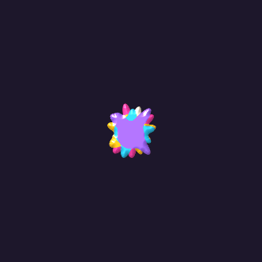
- `magic_puff_ae` + `magic_puff_to_spine`: a magic smoke puff for a wide banner (2172 x 724 by default) that is
  *simulated*, not a still pushed around. Python runs a 2D smoke simulation (stable fluids: exact pressure projection,
  vorticity confinement, curl-noise stirring) over the whole banner: gas appears at the centre from nothing and bursts
  out both ways, each side with its own turbulence. Soft barriers along the gold lines hold it in a band until the
  ends, where the front rolls up into curling vortex pairs. Then the barriers let go, it billows, lifts a little and
  dissolves thin-first. The glow is a heat pass (freshness: hot where the gas is new) that dies as the smoke swirls;
  the nebula detail is advected with the flow so it rides the swirl. The After Effects script builds the look in its
  own project (palette ramp, the hot glow keyed out, cooling, bloom, a softened density matte that erodes thin-first;
  Pro Levels keys, since Easy Levels cannot be keyed on AE 2026). `magic_puff_to_spine` renders `<comp>_full`,
  resamples it to an even 20 fps and lands it as ONE full-width sequence, with the light done natively over it: the
  pop, the gold lines drawn outward with glints, flares igniting, a shimmering ray fan from the bottom flare, an
  ambient glow, and glitter on paths the simulation advected. Measured on the 2172 x 724 banner at 0.6 scale: 77
  bones, 76 slots, 2 atlas pages, at most 3 draw calls after `optimize_draw_order`. A preview of the look renders
  without AE, so the motion is tuned before each AE run.

  
- `shake` is the violent, growing shake before a burst. After Effects adds the light: the `lens_flare` template (an
  optical ghost chain; land its off-centre source with `ae_fx_to_spine anchor=` and `feather=`) and `surface_sweep`
  (a shine that sits on the surface: the art's own colours brightened in a band bent round the volume; play it with
  `deform_like=` so it bends with the art's meshes). `ae_check` confirms what a saved .aep holds.
- Slot tools: `edit_slots` (hide, show, remove, blend, tint, move in the draw order; every animation's draw-order
  keys are rewritten so they keep meaning the same order), `clone_art` (copy slots and their bone subtree under a
  prefix at an offset, images shared, weighted meshes re-pointed: one symbol becomes a reel column, and
  `sphere_spin frames_from=` lets every copy reuse one set of turn frames), `art_twin` (an additive twin of any art,
  hidden until keyed) and `hue_cycle` (walk a twin's tint round the colour wheel: a rainbow wash inside the art).

Characters and animals are rig recipes that read your PSD by layer name and return a finished rig plus a standard clip
set, so swapping the theme means swapping the PSD ([docs/RIGS.md](docs/RIGS.md)):

| | | |
|---|---|---|
| 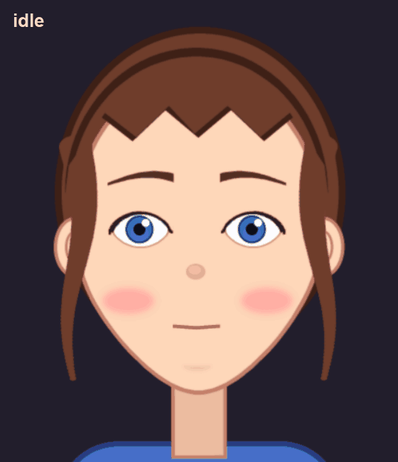 rig_face: look, blink, brows, expressions | 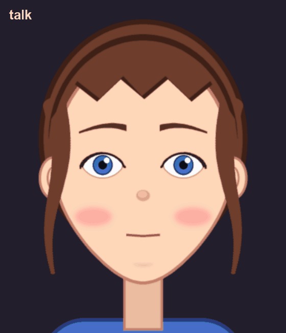 lipsync + look_at | 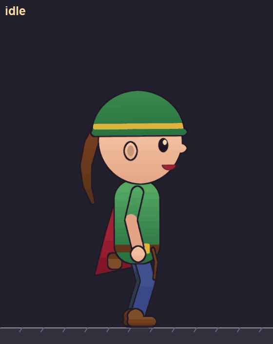 rig_biped + clip_set |
| 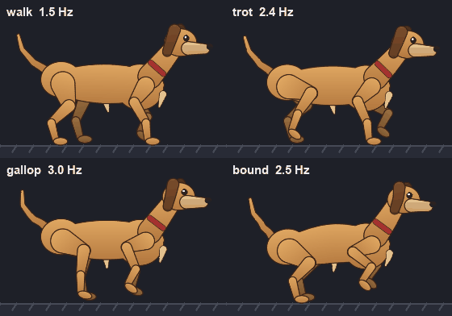 gait + rig_quadruped | 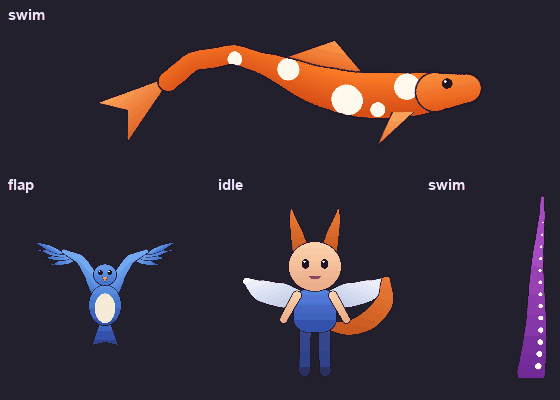 rig_serpent, rig_flier, attach_rig | 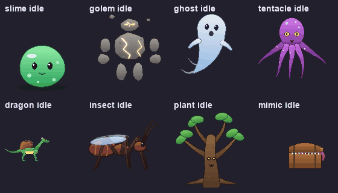 rig_creature: eight kinds |

## How it works

### One typed model: `ir.py`

All Spine 4.2 JSON goes through Pydantic models. Two rules keep round-trips
safe:

- **Spine's defaults.** Saving drops every field that is still at its runtime
  default.
- **Unknown fields survive.** New-version and editor-only fields are written
  back untouched.

Five real production exports round-trip with zero meaningful diffs.

The model also owns one trap. Weighted vertices refer to bones by **index**,
so inserting a single bone silently moves every weighted mesh onto the wrong
bones. Every change to the bone list goes through `remap_bone_indices`.

### Meshes: `geometry.py`

The pipeline runs in this order:

1. Pad the alpha mask.
2. Trace the outline (Moore neighbour).
3. Simplify with Douglas-Peucker, keeping the tolerance below the pad. This
   provably never clips art, and the result is checked.
4. Refine hull edges finer near joints. A hull edge that spans an elbow
   cannot bend.
5. Add interior points with Poisson-disk sampling, denser at joints.
6. Triangulate with a conforming Delaunay that is *verified*. Any hull edge
   still missing is split, and an exact constrained Delaunay (ear clipping
   plus Lawson flips) is the fallback.

Every mesh satisfies `triangles = 2n − hull − 2`, stays inside the image (the
editor clamps UVs outside 0–1 and the texture shifts), and imports into Spine
with zero repairs. Fuzzing 1,000 random silhouettes found four separate
degeneracies. All four are fixed and covered by tests.

### Weights: `weights.py`

Weights use bone-heat diffusion (Baran & Popović 2007, in 2D). The system is
`(L + A·H) w = A·H·p`, where L is the cotangent Laplacian and H is 1/d² to
the nearest bone segment visible inside the outline. As a result:

- A vertex halfway along a long bone belongs to that bone. Inverse distance
  to joints pulls it toward the next joint.
- Weights blend smoothly across joints.
- Heat cannot jump across a gap in the art, such as between two fingers.

After the solve, weights under 0.05 are pruned, each vertex keeps at most 4
influences, and every vertex is renormalised to sum to exactly 1. Tested
properties: 0 folded triangles at a 45° elbow, and finger weights do not leak
across the gap.

### Constraints: `rig.py`

- **IK:** the bend direction is taken from the setup pose. The target sits
  under the juice bones, so slams carry it.
- **Physics presets:** hair, cloth, tail, ribbon, jiggle, antenna and tassel,
  with values documented against what the runtime actually does. `damping`
  is the velocity *kept* per 1/60 s, and `limit` caps how far a reel slam can
  fling a lock of hair.
- **`rig_strand`:** builds a chain along the part's own centre line, then a
  mesh and physics, in one call.
- **`rig_turn`:**
  - The face mesh's middle travels with one control while its outline stays
    pinned. Each row gets a parabola weight profile, which cannot fold inside
    the turn range.
  - Features move by depth through local/relative transform constraints.
  - Everything happens in a screen-aligned frame. In the head bone's own
    frame, "turn" would nod.

### Juice and the symbol contract: `juice.py`

Every symbol gets `idle`, `land`, `win`, `win_loop`, `anticipation` and `dim`.
The optional clips are `scatter_trigger`, `wild_expand`, `flip`, `flip_depth`,
`multiplier_fly` and `win_big`/`win_mega`/`win_epic`.

The presets animate only two inserted bones: `juice_ground` (pivot at the
base) and `juice_core` (pivot at the centre). The artist's own keys are never
touched.

The clips follow these guarantees, all of them tested:

- One-shots end exactly on the setup pose.
- Loops match at both ends.
- `intensity` scales every amplitude.
- Events fire for the game: `sfx_land`, `sfx_win`, `rollup_start`/`rollup_end`
  and `fx_*`.

### FX: `fx.py`

The presets are explosion (flash, shockwave, radial sparks and smoke),
shockwave, coin burst and shower, ripple, glow pulse, sparkle and shine sweep.

- **Coins** spin through a flipbook sequence on true parabolas: x is linear,
  y is eased up and then down.
- **The ripple** is a seamless loop of staggered rings.
- **The shine** is clipped to the part's own outline and simplified to 32 or
  fewer clip vertices.

All textures are procedural and white, tinted per slot, so one tiny texture
serves every colour. Each FX slot is hidden in the setup pose. Each preset
fires `fx_<preset>`, so the engine's particle emitter can take over heavy
counts.

### QA: `qa.py`, `runtime.py`, `render.py`

`validate` checks:

- References
- Weights
- Triangulations
- UV range
- Curve array lengths
- Key order
- Events
- Draw order

It then loads the skeleton in **spine-core** and applies every animation frame
by frame, with physics stepping.

`qa_budget` uses per-profile limits (`mobile_symbol`, `mobile_banner`,
`mobile_character`, `desktop`). It estimates draw calls the way spine-webgl and
spine-pixi batch: a new call at every change of blend mode or atlas page along
the draw order, plus clipping. It then says what to fix.

`preview` rasterises the runtime's posed triangles to GIFs. It was
cross-checked frame for frame against the Spine editor's own PNG export.

## Tests

```bash
uv venv && uv pip install -e ".[dev]" && (cd validator && npm ci) && pytest
```

There are 1,028 tests:

- IR round-trip and bone remapping
- Meshing, plus 300 random silhouettes in CI (1,000 run locally)
- Weight properties
- Rigs
- Every juice clip, FX preset and FX recipe, with each recipe's physics read back from its keys (springs, drag,
  restitution, lags, Poisson schedules, loop closure)
- Every rig recipe: faces, bipeds, quadrupeds, gaits, serpents, fliers, add-ons and creatures, with planted feet
  and clip contracts measured in the runtime
- QA catching broken input
- The MCP tool chain
- The runtime

The Spine round-trip test skips unless the editor is installed. It imports a fully
rigged character into the real editor, exports it again, and requires every
mesh, weight and physics value to come back identical, with no importer
repairs.

## Limits

- **Weights are a strong first pass, not a finished hero rig.** Hands and
  faces still want an artist's pass. Linear blend skinning still collapses on
  the inside of bends past ~90°.
- **The turn rig needs separated layers.** Eyes, brows, nose, mouth, ears and
  front/back hair must each be their own layer.
- **The preview renderer is exact about geometry, not shading.** It has no
  MSAA and no two-colour tint.
- **Spine licensing still applies.** Using the Spine Runtimes requires a Spine
  license, and `make_editable` / `export_runtime` need a licensed editor.

## License

MIT. See `LICENSE`. The original work is © 2026 Egor Fedorov; this fork is
© 2026 kumikilongyeyo.

## Claude Code skills

`skills/` ships three production skills (install with `sh skills/install.sh`): `clip-breakdown` watches a clip and writes an animator's breakdown; `clip-to-spine` rebuilds its effects in Spine with AE for real noise; and `ae-vfx-director` plans, self-reviews and optimizes realistic/premium/stylized/anime AE VFX before the Spine handoff. See [skills/README.md](skills/README.md).
